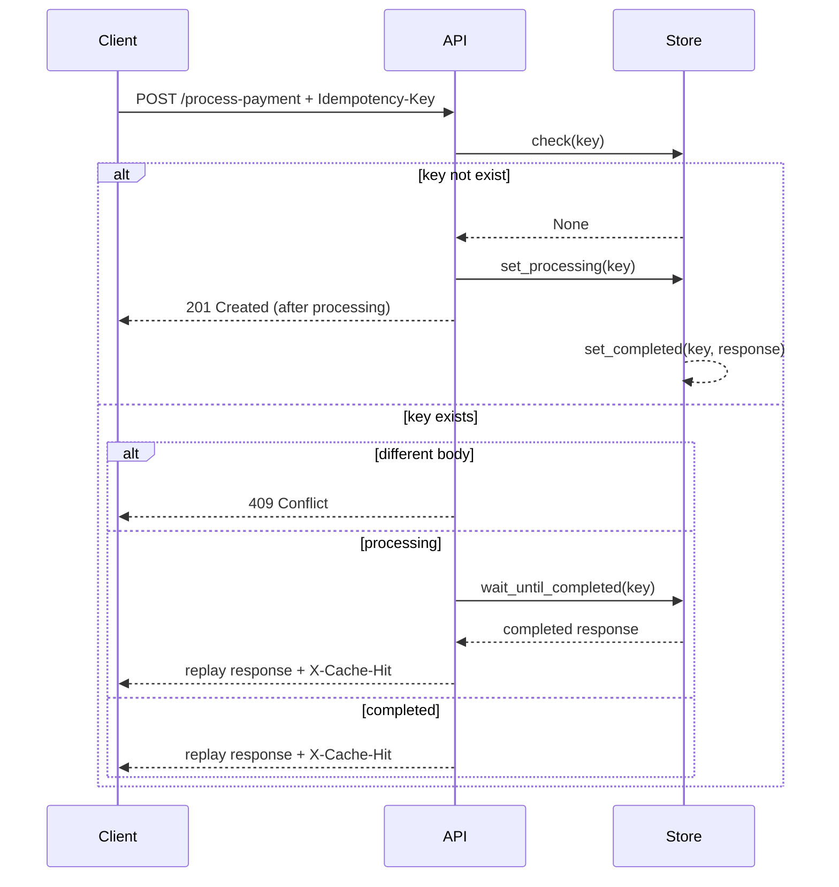

# Idempotency Gateway (Pay-Once Protocol)

A RESTful API that ensures payment requests are processed **exactly once**, preventing double-charges.

---

## 1. Architecture Diagram



---

## 2. Setup Instructions

1. Create virtual environment:
   ```
   python -m venv venv
   ```

2. Install dependencies:
   ```
   pip install fastapi uvicorn pydantic
   ```

3. Run the server:
   ```
   uvicorn app.main:app --reload
   ```

4. Open in browser:
   ```
   http://127.0.0.1:8000/docs
   ```

---

## 3. API

### POST /process-payment

**Header:**
```
Idempotency-Key: <string>
```

**Body:**
```json
{
  "amount": 100,
  "currency": "GHS"
}
```

**Success Response:**
```
201 Created
{
  "message": "Charged 100 GHS"
}
```

**Duplicate request:**
- Same response
- `X-Cache-Hit: true`

**Conflict:**
- 409 Conflict

---

## 4. Design Decisions

- In-memory idempotency store
- Request body hashing to detect conflicts
- Lock for thread safety
- Wait mechanism for in-flight requests
- TTL expiration (Developer’s Choice)

---

## 5. Developer’s Choice Feature

### TTL Expiration for Idempotency Keys

In a real-world fintech system, idempotency keys should not live indefinitely.  
To prevent memory bloat and stale data accumulation, I implemented a  
Time-To-Live (TTL) mechanism.

Completed idempotency records automatically expire after 5 minutes.

**Why this improves the system:**

- Prevents unlimited memory growth  
- Ensures long-delayed retries are treated safely  
- Mimics real-world payment processor behavior  
- Keeps the system production-conscious  
