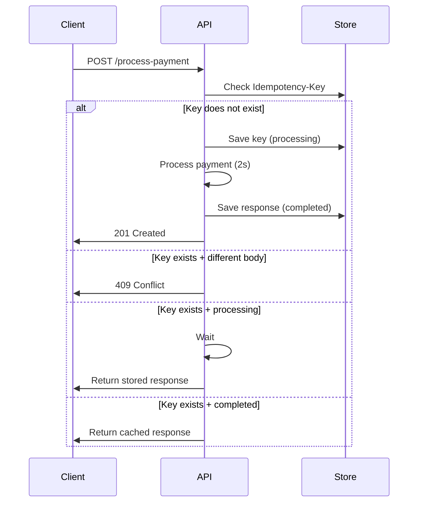

## Architecture Diagram

```mermaid
sequenceDiagram
    participant Client
    participant API
    participant Store

    Client->>API: POST /process-payment
    API->>Store: Check Idempotency-Key

    alt Key does not exist
        API->>Store: Save key (processing)
        API->>API: Process payment (2s)
        API->>Store: Save response (completed)
        API->>Client: 201 Created
    else Key exists + different body
        API->>Client: 409 Conflict
    else Key exists + processing
        API->>API: Wait
        API->>Client: Return stored response
    else Key exists + completed
        API->>Client: Return cached response
    end
```
